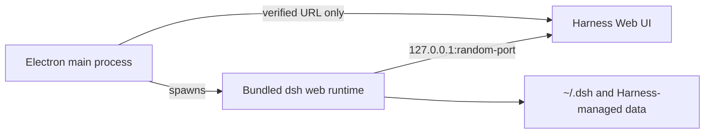

# DeepSeek Harness Desktop

[中文](#中文说明) · [English](#english)

A macOS-first desktop container for [DeepSeek Harness](https://github.com/deepseek-ai/deepseek-harness).

DeepSeek Harness Desktop starts a managed local `dsh web` runtime and loads its verified loopback URL in a secure Electron window. It preserves the upstream Harness experience while adding a native application lifecycle, a macOS-integrated title bar, a minimal startup surface, and a distributable installer.

> [!WARNING]
> DeepSeek Harness is in developer preview. This project is an independent desktop wrapper; it is not an official DeepSeek product and does not add a sandbox around Harness tools.

## 中文说明

DeepSeek Harness Desktop 是 [DeepSeek Harness](https://github.com/deepseek-ai/deepseek-harness) 的 macOS 优先桌面容器。它启动并托管本地 `dsh web` 服务，再将经过验证的本地页面加载到 Electron 窗口中；不会 fork 或重写上游 Harness 的 Agent、会话或 Web UI。

### 特性

- 原生 macOS 应用窗口与鲸鱼应用图标。
- 自动启动 `dsh web --host 127.0.0.1 --port 0`，使用随机 loopback 端口。
- 仅加载经过验证的本地 Runtime URL，拒绝外部导航和新窗口。
- 启动页使用 macOS vibrancy / Liquid Glass 风格，Runtime 未就绪时提供重试与脱敏诊断复制。
- 关闭窗口时终止受管 Runtime 进程树，不删除 `~/.dsh`、会话或工作区数据。
- macOS `.dmg` 内置固定版本的 Harness Runtime；安装后不依赖本机的 Harness checkout 或 pnpm。

### 安装

当前提供 Apple Silicon（arm64）构建。请从 GitHub Releases 下载 `.dmg`，挂载后将应用拖入 `Applications`。

开发版未签名和未公证时，macOS 可能阻止首次打开：在应用上右键并选择“打开”即可。

### 从源码开发

前提：Node.js `^22.19.0 || >=24.0.0`、pnpm，以及一个可运行的 DeepSeek Harness checkout。

```bash
git clone <your-repository-url>
cd deepseek-harness-desktop
pnpm install
pnpm prepare:runtime
DSH_RUNTIME_DIR=/absolute/path/to/deepseek-harness pnpm dev
```

开发模式使用 `DSH_RUNTIME_DIR` 指定的上游 checkout；发布包改用 `resources/runtime` 中锁定的 npm Runtime。

### 打包

```bash
pnpm package:mac
```

产物位于 `release/DeepSeek Harness Desktop-<version>-arm64.dmg`。

## English

### Features

- Native macOS application window with the upstream whale application icon.
- Managed `dsh web --host 127.0.0.1 --port 0` process on a random loopback port.
- Verified local-only navigation, no arbitrary external navigation, and denied popup windows.
- macOS vibrancy / Liquid Glass-style launch surface with retry and redacted diagnostics.
- Clean runtime-process teardown without deleting `~/.dsh`, sessions, or workspace files.
- A macOS `.dmg` that embeds a pinned Harness Runtime, so an installed app does not require a local Harness checkout or pnpm.

### Architecture



Ownership is intentionally one-way: Electron owns the Runtime process; the Runtime owns Harness; Harness owns its own configuration, sessions, and workspace behavior.

### Security and data boundaries

- Electron runs with `nodeIntegration: false`, `contextIsolation: true`, and `sandbox: true`.
- The Runtime is always bound to `127.0.0.1`; LAN exposure is not allowed.
- Desktop state and diagnostics do not intentionally store prompts, session contents, workspace files, API keys, or authorization headers.
- Harness itself can read/write the selected workspace and execute configured tools. This wrapper is not an additional permission sandbox.

### Development

Requirements: Node.js `^22.19.0 || >=24.0.0`, pnpm, and a runnable DeepSeek Harness checkout.

```bash
git clone <your-repository-url>
cd deepseek-harness-desktop
pnpm install
pnpm prepare:runtime
DSH_RUNTIME_DIR=/absolute/path/to/deepseek-harness pnpm dev
```

`DSH_RUNTIME_DIR` is required for development. The packaged application instead uses the pinned runtime in `resources/runtime`.

### Packaging

```bash
pnpm package:mac
```

The generated artifact is written to `release/`. Current packaging targets Apple Silicon (`arm64`). Code signing and notarization should be configured before public distribution.

### Roadmap

- [x] macOS MVP and managed local Runtime lifecycle
- [x] Bundled Runtime and Apple Silicon DMG
- [ ] Upstream GitHub/npm update notifications
- [ ] Code signing and notarization
- [ ] Intel macOS, Windows, and Linux builds

## License and attribution

This project is released under the [MIT License](LICENSE).

The DeepSeek Harness mark, wordmark, and derived application icon are sourced from the upstream DeepSeek Harness repository and are covered by its MIT License. See [THIRD_PARTY_NOTICES.md](THIRD_PARTY_NOTICES.md) for details. “DeepSeek” and “DeepSeek Harness” may be trademarks of their respective owners.
